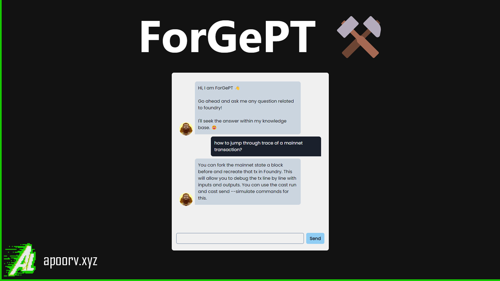

# ForGePT

Solve your Foundry-related queries with ChatGPT, trained on the Foundry book and 'Foundry Support' tg channel.

**https://forgept.apoorv.xyz/**



--- Original Docs ---

Tools and APIs used:

- Next.js
- LangchainJS
- Pineceone Vector Database
- GPT3

### How it works

The app takes text (text files), embeds them into vectors, stores them into Pinecone, and allows semantic searching of the data.

For anyone wondering what Semantic search is, here is an overview (taken directly from ChatGPT4):

**Semantic search refers to a search approach that understands the user's intent and the contextual meaning of search queries, instead of merely matching keywords.**

**It uses natural language processing and machine learning to interpret the semantics, or meaning, behind queries. This results in more accurate and relevant search results. Semantic search can consider user intent, query context, synonym recognition, and natural language understanding. Its applications range from web search engines to personalized recommendation systems.**

## Running the app

### Prerequisites

To run this app, you need the following:

1. An [OpenAI](https://platform.openai.com/) API key
2. [Pinecone](https://app.pinecone.io/) API Key

### Up and running

To run the app locally, follow these steps:

1. Clone this repo

```sh
git clone https://github.com/apoorvlathey/forgept-nextjs
```

2. Change into the directory and install the dependencies using PNPM

3. Copy `.example.env.local` to a new file called `.env.local` and update with your API keys and environment.

   **Be sure your environment is an actual environment given to you by Pinecone, like `us-west4-gcp-free`**

4. (Optional) - Add your own custom text or markdown files into the `/documents` folder.

5. Run the app:

```sh
npm run dev
```

### To create embeddings:

Visit the following path (while in development environment): `/setup` and press the button. Keep track of progress in your terminal's console.

### Need to know

When creating the embeddings and the index, it can take up to 2-4 minutes for the index to fully initialize. There is a settimeout function of 180 seconds in the `utils` that waits for the index to be created.

If the initialization takes longer, then it will fail the first time you try to create the embeddings. If this happens, visit [the Pinecone console](https://app.pinecone.io/) to watch and wait for the status of your index being created to finish, then run the function again.

> Forked from: [semantic-search-nextjs-pinecone-langchain-chatgpt](https://github.com/dabit3/semantic-search-nextjs-pinecone-langchain-chatgpt)
> The base of this project was guided by [this Node.js tutorial](https://www.youtube.com/watch?v=CF5buEVrYwo), with some restructuring and ported over to Next.js. You can also follow them [here](https://twitter.com/Dev__Digest/status/1656744114409406467) on Twitter!

### Getting your data

I recommend checking out [GPT Repository Loader](https://github.com/mpoon/gpt-repository-loader) which makes it simple to turn any GitHub repo into a text format, preserving the structure of the files and file contents, making it easy to chop up and save into pinecone using my codebase.
